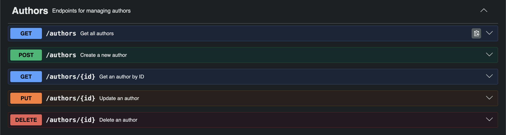
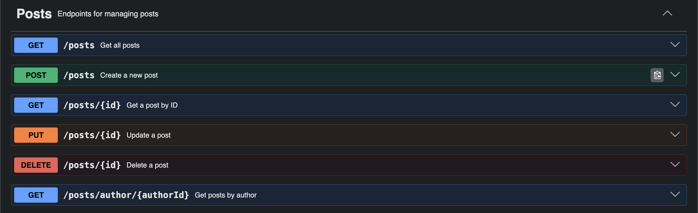
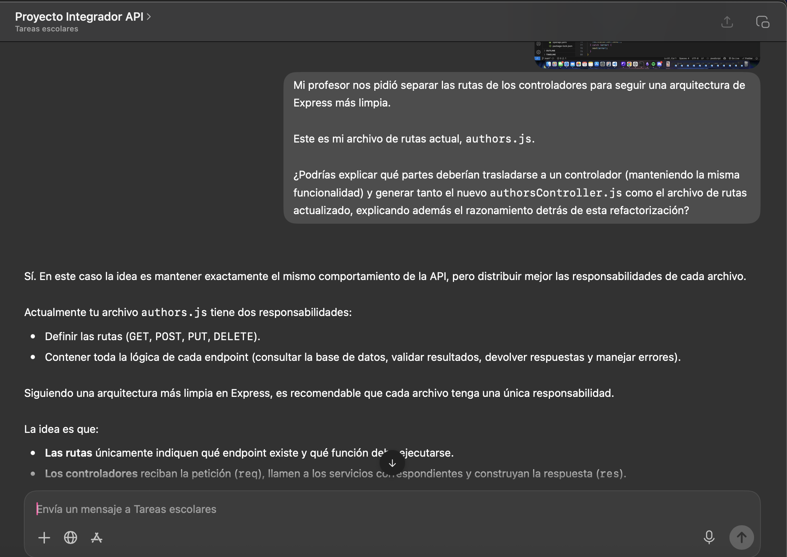
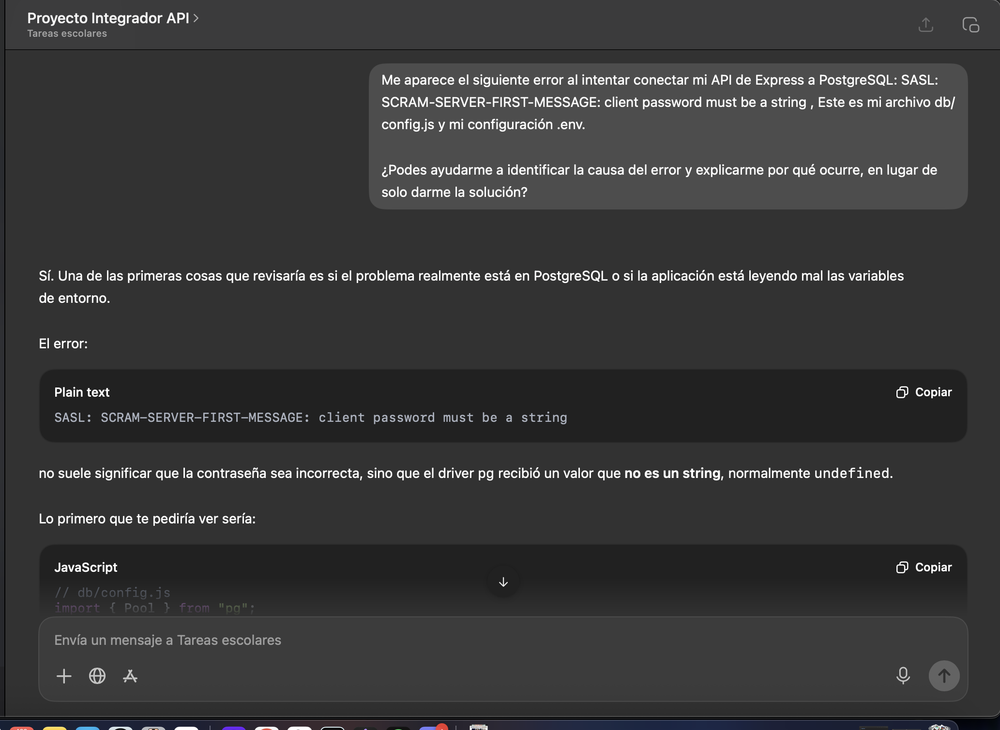

# 🌸 MiniBlog API

REST API developed with **Node.js**, **Express**, and **PostgreSQL** as the Module 2 Integrative Project at **Soy Henry**.

---

---

# 🌐 Live Demo

## API

**https://proyectom2solangeaimery-production.up.railway.app**

## Swagger Documentation

**https://proyectom2solangeaimery-production.up.railway.app/api-docs/**

---

# 💜 About the Project

MiniBlog API was developed with the goal of building a complete backend application following good development practices.

The application allows managing **authors** and **posts** through a REST API, implementing CRUD operations, data persistence, validations, documentation, and automated testing.

During development, the following concepts were applied:

- REST Architecture.
- Express.
- PostgreSQL.
- Data Validation.
- Testing.
- OpenAPI Documentation.
- Railway Deployment.

---

# 📸 Preview

### Swagger Documentation


### Authors Endpoints



### Posts Endpoints



---

# ✨ Features

- 📚 Complete CRUD for Authors.
- 📝 Complete CRUD for Posts.
- 🛡️ Input data validation.
- 🗄️ PostgreSQL data persistence.
- 📖 Interactive Swagger documentation.
- 🧪 Automated tests with Vitest.
- 🚂 Railway deployment.

# 🚀 Technologies

- Node.js
- Express
- PostgreSQL
- pg
- Vitest
- Supertest
- Swagger UI Express
- OpenAPI 3.1

---

# 📋 Requirements

Before running the project, make sure you have installed:

- Node.js
- PostgreSQL
- npm

---

# 📦 Installation

Clone the repository

```bash
git clone https://github.com/solangeAimery98/ProyectoM2_SolangeAimery/tree/main
```

Navigate to the project folder

```bash
cd ProyectoM2_SolangeAimery
```

Install dependencies

```bash
npm install
```

---

# ⚙️ Environment Variables

Create a `.env` file

```env
PORT=3000

DB_HOST=
DB_PORT=
DB_NAME=
DB_USER=
DB_PASSWORD=
```

---

# 🗄️ Database

Create the PostgreSQL database and run the SQL files included in the project:

```sql
setup.sql
```

Then load the seed data:

```sql
seed.sql
```

---

# ▶️ Running the Project

Development mode

```bash
npm run dev
```

Production mode

```bash
npm start
```

---

# 🧪 Running the Tests

```bash
npm test
```

---

# 📖 Documentation

With the server running locally:

```
http://localhost:3000/api-docs
```

Production:

```
https://proyectom2solangeaimery-production.up.railway.app/api-docs/
```

---

# 📌 Endpoints

## 👩🏻‍💻 Authors

| Method | Endpoint     |
| ------ | ------------ |
| GET    | /authors     |
| GET    | /authors/:id |
| POST   | /authors     |
| PUT    | /authors/:id |
| DELETE | /authors/:id |

---

## 📝 Posts

| Method | Endpoint                |
| ------ | ----------------------- |
| GET    | /posts                  |
| GET    | /posts/:id              |
| GET    | /posts/author/:authorId |
| POST   | /posts                  |
| PUT    | /posts/:id              |
| DELETE | /posts/:id              |

---

# 🚂 Deployment

## API

**https://proyectom2solangeaimery-production.up.railway.app**

## Swagger

**https://proyectom2solangeaimery-production.up.railway.app/api-docs/**

---

# 🤖 Use of Artificial Intelligence

During the development of this project, I used ChatGPT as a learning and support tool to:

- Solve questions related to Express.
- Work with PostgreSQL.
- Understand and debug errors.
- Review SQL queries.
- Improve the project documentation.
- Resolve deployment issues.
- Better understand concepts learned throughout the project.

All implementation decisions, project structure, and final functionality were completed and verified by me.

---

# 📸 AI Assistance Examples

### AI Consultation 1



### AI Consultation 2



---

# 👩🏻‍💻 Author

**Solange Aimery**

GitHub

https://github.com/solangeAimery98
